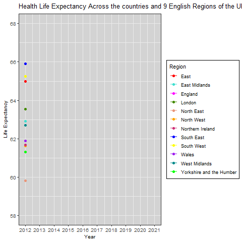

```{r setup, include=FALSE}
knitr::opts_chunk$set(echo = TRUE, dev = "png")

#Housekeeping:
#Clear the workspace
rm(list = ls())

#Install and load relevant packages
required_packages <- c("tidyverse", "here", "ggplot2", "gganimate", "gifski", "kableExtra", "plotly") #creates vector with all required packages
all_packages <- required_packages[!(required_packages %in% installed.packages()[, "Package"])] #creates new vector of packages not installed. ! finds packages not installed, %in% tests whether a package is installed
if (length(all_packages)) install.packages(all_packages) #installs missing packages
lapply(required_packages, library, character.only = TRUE) #loads each package                        

```


## Research Question:
**How has healthy life expectancy changed across the years for England, Northern Ireland, Wales, and English regions?**

The COVID-19 pandemic resulted in the closure of many hospitals and social activities, impeding access to healthcare and driving an increase in isolation. This had adverse impacts on both physical and mental health, increasing rates of depression and stress (Mehlmann-Wicks, 2022), factors likely influencing healthy life expectancy. The unavailability of sufficient healthcare access may also have hindered illness diagnoses' and exacerbated health inequalities.

This data includes statistics about health life expectancy during the years of peak COVID-19. It could be interesting to see how the pandemic impacted healthy life expectancy and how rates compare to life before lockdown and other regions.

The rationale for this study is that previous graphs provided visualisations of health life expectancy for each region, although these were separate. The graph in this project offers a direct side-by-side comparison between different areas, making it easier to see how trends changed overtime, and how this varied in relation to other regions. It also adds a dynamic aspect to achieve greater engagement with the changing trends.


## Data origins:
The data for this project was made available by the Office for National Statistics
It was collected as part of an annual population survey and census, where healthy life expectancies are estimated using a Sullivan life table.

Unfortunately, data for Scotland is currently unavailable as it is not yet included on the National Statistics webpage.
Although when it becomes accessible, the code for this project should implement it with ease when the updated dataset is loaded

The raw dataset can be downloaded at:
*https://www.ons.gov.uk/peoplepopulationandcommunity/healthandsocialcare/healthandlifeexpectancies/bulletins/healthstatelifeexpectanciesuk/between2011to2013and2020to2022*


## Data preperation

For this question, all regions in the dataset are included in the visualisation.
However, the health life expectancies for males and females are averaged into a single value for each region and year, and as years existed as a range, midpoints were used to improve clarity and plotting.

There were also some formatting changes that were necessary to make as the original download came in .xlsx format, although this created issues when reading into my version of R and attempting to prep the data. I therefore converted it to .csv; the code for which is included below if it's required
```{r converting to .CSV}
#NOTE:
#Please use code below to convert the into .csv format if required:
#if(!require(readxl)){install.packages("readxl");library(readxl)}
#data <- read_excel(here("data", "download1.xlsx"))

#If the data is downloaded from github, it should be in a folder called "data" and already exist in .csv format.
```


#### Loading in and initial clean of data
```{r echo= TRUE, warning = FALSE, message = FALSE}
#Loading in the data and remove first 5 rows as this is just text information about the data
data <- read.csv(here("data","rawdata","trends in life expectancy.csv")) %>% slice(-1:-5)

#We should first remove all N/A values
data_filtered <- data %>% drop_na()

#Now we need to check there are no missing values
if(sum(is.na(data_filtered)) == 0) {
  print("No missing vaules")
} else {
  print(paste("Count of total missing values:", sum(is.na(data_filtered))))
}

#Remove header row and set first row as column names
colnames(data_filtered) <- data_filtered[1, ]
data_filtered <- data_filtered[-1, ]
colnames(data_filtered) <- make.names(colnames(data_filtered))

#Remove data relating to UCI and LCI, so that only healthy life expectancy values remain
data_cleaned <- data_filtered %>%
  select(-contains("LCI"), -contains("UCI"))

#Change names in the Year column
colnames(data_cleaned) <- gsub("^X", "", colnames(data_cleaned)) # Remove the "X" at the start
colnames(data_cleaned) <- gsub("\\.to\\.", "-", colnames(data_cleaned)) #Replace ".to." with "-"
colnames(data_cleaned) <- gsub("\\.HLE$", "", colnames(data_cleaned)) #Remove ".HLE" at the end

#Reshape dataset to long format
data_long <- data_cleaned %>% pivot_longer(cols = starts_with("2"), names_to = "Year", values_to = "Life.Expectancy")

#Sanity check: lets check the data has the first row as column names, displays the correct names, and only contains data for healthy life expectancy
#Display column names
colnames(data_long)

```


#### Creating midpoints and means
In the raw data, 'Years' existed as overlapping ranges (e.g., 2011-2013 and 2012-2014). I therefore used the midpoint value for each year to simplify the scale and improve readability
```{r echo= TRUE, warning = FALSE, message = FALSE}

#Calculate midpoint for year and clean up columns
data_long <- data_long %>%
  mutate(
    Start_Year = as.numeric(substr(Year, 1, 4)),  # Extract the start year
    End_Year = as.numeric(substr(Year, 6, 9)),    # Extract the end year
    Midpoint_Year = (Start_Year + End_Year) / 2   # Calculate the midpoint
  ) %>% filter(!is.na(Midpoint_Year)) %>%
  select(-Year, -Start_Year, -End_Year) %>%
  rename(Year = Midpoint_Year) #Remove old "Year", "Start_Year", and "End_Year" columns, then rename Midpoint_Year column
```


Now the 'Year' column has been prepped, it should be numeric. I can now convert the life expectancy column to numeric, and calculate the mean gender healthy life expectancies
```{r warning = FALSE, message = FALSE, options(warn=0)}
#Check if year and life expectancy columns are numeric
print(sapply(data_long, is.numeric))

#Convert life expectancy to numeric
data_long <- data_long %>% mutate(Life.Expectancy = as.numeric(Life.Expectancy))

#Check data is now numeric
print(is.numeric(data_long$Life.Expectancy))

#Groups dataset by columns and allows flexibility with other datasets. Important if dataset is updated to Include Scotland
summarize_data <- function(data, group_var, value_var) {
  data %>%
    group_by(across(all_of(group_var))) %>%
    summarize(mean_value = mean(.data[[value_var]], na.rm = TRUE)) #Calculate mean across gender for each region and year
}

#Calls the summarise function and assigns it to data_final
data_final <- summarize_data(data_long, group_var = c("Area.name", "Year"), value_var = "Life.Expectancy") %>%
  filter(!is.nan(mean_value))  # Ensure no NaN values remain

#Change column names
colnames(data_final) <- c("Region", "Year", "Mean_Healthy_Life_Expectancy")

#Sanity check: Check data contains correct information and only the rows/columns required for visualisation exist
tableh <- knitr::kable(head(data_final, n = 12), "html", col.names = c("Region","Year","Mean_Healthy_Life_Expectancy"))
kableExtra:: kable_styling(tableh,bootstrap_options = c("striped", 'condensed', "scale_down" ),position = "left", font_size = 10) 

```


```{r, warning=FALSE, message=FALSE}
#Save the prepped dataset
write.csv(data_final, here("data", "prepped_data", "prepped_data.csv"), row.names = FALSE)
```


## Creating the visualisation
#### Initial graph

The initial plot was alright, although the aesthetics could be largely improved, particularly the axes, line width, and some of the colours are too similar. The code below demonstrates how the improved aesthetics have been coded

```{r, warning=FALSE, message=FALSE, fig.width=10, fig.height=8, dpi = 100}
#The graph will contain a range of lines, and the 'custom_colors' function makes it easier to distinguish between the regions than the original colours
custom_colors <- c("red", "turquoise", "magenta", "chartreuse4", "darksalmon", "orange", "violetred3", "blue", "yellow", "purple", "darkcyan", "green")


#Designing plot
plot <- ggplot(data_final, aes(x = Year, y = Mean_Healthy_Life_Expectancy, color = Region, group = Region, 
  text = paste("Region:", Region, # Defines custom tooltip for interactive plot
               "<br>Year:", Year, 
               "<br>Mean Healthy Life Expectancy:", 
               Mean_Healthy_Life_Expectancy))) + 
  geom_line(linewidth = 0.8, alpha = 0.5) + 
  scale_color_manual(values = custom_colors) + #Here I thinned the lines and added transparency as this makes it clearer to distinguish between the regions when overlapping and in close proximity 
  geom_point(size = 2) + 
  labs(title = "Health Life Expectancy Across the countries\nand 9 English Regions of the UK:", 
       x = "Year", 
       y = "Life Expectancy", 
       color = "Region") + 
  theme(axis.text.x = element_text(angle = 45, hjust = 1)) + # I rotated x-axis labels for better clarity
  scale_y_continuous(limits = c(58, 68), 
                     breaks = seq(58, 68, by = 2)) + # Set axis limits and changed scale intervals to improve readability. I found these values gave the clearest representation
  scale_x_continuous(breaks = unique(data_final$Year)) + 
  theme_bw() +
   theme(
    panel.grid.major = element_line(color = "gray87", size = 0.5),
    panel.background = element_rect(fill = "seashell", color = NA),
    plot.background = element_rect(fill = "white", color = NA),
    axis.text = element_text(size = 10),
    axis.title = element_text(size = 10, face = "bold"),
    legend.background = element_rect(fill = "white", color = "black"),
    legend.key = element_blank(),
    legend.box = "vertical"
   )

#View plot
plot

#If you would like to save the plot:
ggsave(here("plots", "plot.png"), bg = "white", width = 10, height = 8, units = "in")

```
The graph now has a cleaner appearance and, despite some overlap, the lines are easier to read. I decided to keep the background a basic light colour as I think it works well with contrasting the different line colours, as well as the grid lines to help better read the Y axis


## Animating the graph - main visualisation
To demonstrate a higher level of coding, I made the graph animated so that it progresses throughout the years. This aimed to improve engagement with the plot and better visualise how the trend changed throughout the years and will be the main graph for this project
```{r, warning=FALSE, message=FALSE, fig.width=10, fig.height=8, dpi = 100}

#Animating plot
animated <- plot +
 geom_point(size = 2, aes(group = seq_along(Year))) +
  transition_reveal(Year) +
  ggtitle('Health Life Expectancy Across the countries and 9 English Regions of the UK: {round(frame_along)}')


#This will allow the gif to be knit into the html document
if(knitr::is_html_output()){ anim_save(here("plots" , "animated.gif"), 
            animated, renderer = gifski_renderer())}
                                                    
#Save the animated plot
anim_save(here("plots", "animated.gif"), animated, renderer = gifski_renderer())
```





## Interactive graph
I also played around with making the graph interactive, although this would not knit to an html when combined with the animation. While this may allow for a slightly clearer interpretation of each region via the tooltip, I chose the animation over the interactive version as I believe it more closely addresses the question, by better capturing the dynamic nature of how trends change over time.
```{r, warning=FALSE, message=FALSE, fig.width=10, fig.height=8, dpi = 100}
#I have included the code for the interaction
#Making plot interactive
interactive_plot <- ggplotly(plot, tooltip = "text")

#Customising hover box
interactive <- interactive_plot %>%
  layout(hoverlabel = list(bgcolor = "white", font = list(size = 10, color = "black"), 
                           bordercolor = "blue"), title = list(text = "Health Life Expectancy Across the countries and 9 English Regions of the UK: "), margin = list(t = 50)) %>% 
  style(line = list(width = 1.5, opacity = 0.5),
        marker = list(size = 6, opacity = 0.4),
        mode = "line+markers")

#View interactive plot
interactive

```


## Conclusion

When interpreting the graph, there is a clear decrease in healthy life expectancy (HLE) during the COVID-19 years, particularly 2020-2021. This appears to be the case for nearly all regions, highlighting the adverse impacts the disease had on the populations health. It is clear from the graph that Northern Ireland exhibits the smallest decrease during the COVID years, with the West Midlands displaying the sharpest. It is also evident that the North East has the worst HLE across all years, approximately 6 years lower than the South East (which has the highest of all regions). This could be due to a range of reasons, a possible one being different lifestyles between these regions.

A notable limitation of this graph/the data is that it does not extend to more recent years, or provide any predictions about future HLE projections. This data is therefore unable to inform us about how external challenges, such as post-pandemic recovery, may influence HLE, or provide an indication of the time-frame it will take to return to HLE levels of previous years. An additional consideration is that in the wider context, it does not explore the possible factors that influence healthy life expectancy. It is clear that HLE decreased during COVID years, although the precise reasons for this remains ambiguous. Increased social isolation, restricted access to healthcare, and higher rates of stress are likely factors, although they remain unexamined in this graph.

Adding extended datasets from more recent and future years on HLE should be implemented into the above visualisation with ease. This dataset can also provide many informative visualisations, for example, how life expectancy differs between males and females among these regions. Plotting this may address questions comparing  how gender influences HLE, such as 'have differences in HLE between males and females increased or decreased over the years?' and if so, 'which regions have the most change?' Future visualisations will provide interesting answers to these questions, and updated datasets with more recent and future years will highlight any other interesting emerging patterns.

If I were to complete this project again, I think it would be interesting to include data on the key factors that influence healthy life expectancy, and how the impact of these factors also change over time and vary between regions. Looking at other places, such as Scotland (when the data becomes available) and a selection of countries in Europe may also reveal intriguing patterns and how these HLE trends relate to the COVID-19 pandemic.


## References
1. Health state life expectancies in England, Northern Ireland and Wales - Office for National Statistics. (2024, March 26). Www.ons.gov.uk. https://www.ons.gov.uk/peoplepopulationandcommunity/healthandsocialcare/healthandlifeexpectancies/bulletins/healthstatelifeexpectanciesuk/between2011to2013and2020to2022

2. Mehlmann-Wicks, J. (2022, July 28). The impact of the pandemic on population health and health inequalities. The British Medical Association Is the Trade Union and Professional Body for Doctors in the UK. https://www.bma.org.uk/advice-and-support/covid-19/what-the-bma-is-doing/the-impact-of-the-pandemic-on-population-health-and-health-inequalities
